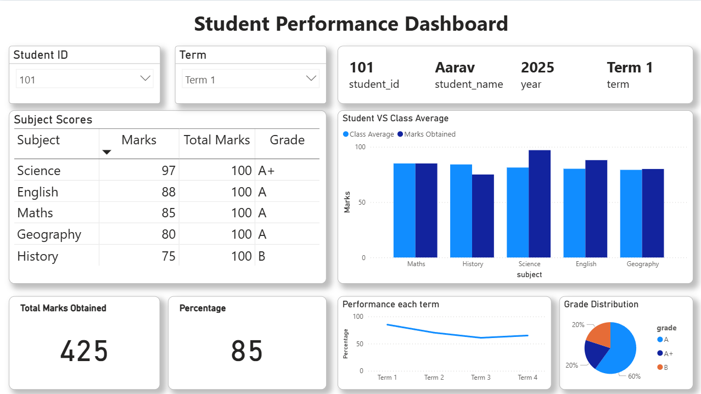

# 📊 Academic-insights-dashboard
### Python + MySQL + Power BI Integration



## 🎯 Project Overview

A comprehensive student performance analytics system that transforms raw academic data into actionable insights through an integrated pipeline. This project demonstrates real-world data engineering practices by implementing a scalable, three-tier architecture that mirrors enterprise-grade analytics solutions.

## Why this matters

This project demonstrates how student performance data can be transformed into actionable insights for educators and administrators. It is designed not just as a dashboard, but as a blueprint for scalable academic analytics

**Key Features:**
- 📤 **One-Click Data Upload** - Python GUI for seamless CSV/Excel file ingestion
- 🗄️ **Centralized Database** - MySQL as single source of truth
- 📈 **Interactive Dashboards** - Power BI visualizations with drill-down capabilities
- 🔄 **Automated ETL Pipeline** - Streamlined data processing and validation

## 🛠️ Tech Stack

| Layer | Technology | Purpose |
|-------|------------|---------|
| **Data Ingestion** | Python (Tkinter, Pandas) | GUI-based file upload & preprocessing |
| **Data Storage** | MySQL | Structured, query-optimized database |
| **Visualization** | Power BI | Interactive dashboards & reporting |

## 🏗️ Architecture

```
┌─────────────────┐    ┌─────────────────┐    ┌─────────────────┐
│   Python ETL    │───▶│   MySQL DB      │───▶│   Power BI      │
│                 │    │                 │    │                 │
│ • File Upload   │    │ • Students      │    │ • Grade Trends  │
│ • Data Cleaning │    │ • Subjects      │    │ • Comparisons   │
│ • Validation    │    │ • Terms         │    │ • Drill-downs   │
└─────────────────┘    └─────────────────┘    └─────────────────┘
```

### Usage

1. **Upload Data**: Launch the Python GUI and select your Excel/CSV file
2. **Automatic Processing**: Data is cleaned, validated, and loaded into MySQL
3. **View Dashboard**: Open the Power BI file and refresh data connections

## 📊 Dashboard Features

### 🎯 Key Metrics
- **Student Performance Tracking** - Individual and cohort progress
- **Subject-wise Analysis** - Comparative performance across subjects
- **Term-over-Term Trends** - Academic progress visualization
- **Grade Distribution** - Performance categorization and insights

### 📈 Interactive Elements
- **Student Filters** - Drill down to individual performance
- **Time Series** - Track improvement over multiple terms
- **Comparative Analysis** - Student vs. class averages
- **Export Capabilities** - Share insights across stakeholders

## 🔧 Technical Highlights

### Data Processing Pipeline
- **Automated Data Validation** - Ensures data quality and consistency
- **Error Handling** - Graceful handling of malformed data
- **Scalable Schema** - Designed for future enhancements

### Database Design
- **Normalized Structure** - Optimized for performance and maintainability
- **Dimensional Modeling** - Star schema principles for BI integration
- **Indexing Strategy** - Optimized query performance

## 🌟 Future Roadmap (Phase 2)

### 🔐 Security & Governance
- **Row-Level Security (RLS)** - Role-based access control
- **Audit Trails** - Track data modifications and access
- **Data Encryption** - Secure sensitive student information

### 📄 Advanced Automation
- **OCR Integration** - Scan physical marksheets directly
- **PDF Processing** - Automated extraction from digital reports
- **Batch Processing** - Handle large datasets efficiently

### ☁️ Cloud & Scale
- **Cloud Migration** - Azure/AWS deployment ready
- **API Development** - RESTful services for external integration
- **Real-time Updates** - Stream processing capabilities

### 🤖 AI & Predictive Analytics
- **Performance Prediction** - ML models for early intervention
- **Anomaly Detection** - Identify at-risk students
- **Recommendation Engine** - Personalized learning paths

## 💡 Why This Architecture?

**Separation of Concerns**: Each layer has a distinct responsibility, making the system maintainable and scalable.

**Industry Standards**: Mirrors real-world enterprise analytics architectures used by Fortune 500 companies.

**Future-Proof**: Designed with extensibility in mind - new data sources, visualization tools, or processing logic can be added without major refactoring.

**Performance**: Database layer ensures efficient querying and reduces processing overhead on visualization tools.

## 🙋‍♂️ Contact

Jash Nandania: [nandaniajash@gmail.com](nandaniajash@gmail.com)

[LinkedIN](www.linkedin.com/in/jash-nandania-402496245)

---

⭐ **Star this repository if you found it helpful!**
